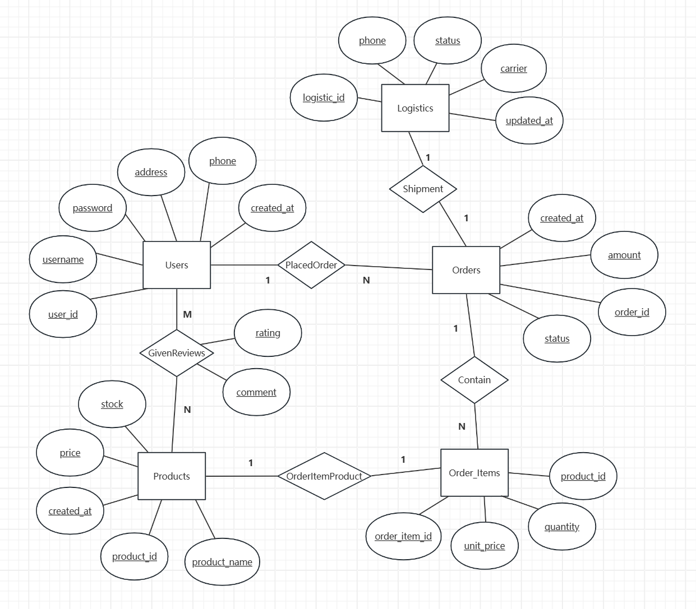

# E-commerce Transaction DBMS

这是上海交通大学数据库原理及安全课程设计项目“电商交易数据库管理系统”

## 1. 需求分析
本系统旨在为单一商店提供全面的电商交易管理解决方案，支持用户注册、登录、浏览商品、下订单、支付、物流跟踪及商品评价等核心功能，同时为商家提供商品和订单的管理工具，提升交易效率和用户体验。

### 1.1 功能需求
#### 1.1.1 商家端
1. 商品管理：
    - 添加、删除商品，实现商品的引进与淘汰。
    - 修改商品描述和价格，查询商品详细信息。
    - 根据库存、上架时间和价格进行商品查询。
2. 订单管理
    - 发货功能，选择承运人并补充物流信息。
    - 查询所有订单，查看订单详情及其对应的多个订单项。
3. 物流管理
    - 自动更新物流单，根据订单信息维护物流状态。
    - 查询物流信息，确保订单运输透明。
4. 评价管理
    - 查询用户对商品的评价，审核并管理评论内容。

#### 1.1.2 用户端
1. 用户管理
    - 查看和修改个人信息，包括密码、地址和电话。
2. 商品浏览与购物
    - 浏览最新上架商品，按名称或描述搜索商品。
    - 将商品加入购物车，进行结账生成订单和物流单，或清空购物车。
3. 订单管理
    - 查看购买记录及订单的物流状态，支持订单取消和支付功能。
4. 评价系统
    - 对已购买商品进行评分和评论，查看商品评价。
### 1.2 非功能需求
1. 性能： 系统应支持至少1000个并发用户，响应时间在3秒以内，日处理量达10,000笔订单。
2. 安全性： 用户密码加密存储，数据传输采用HTTPS，防范SQL注入和XSS攻击。
3. 可用性与可维护性： 系统全年可用率不低于99.5%，定期备份，代码规范，文档完善。
4. 可扩展性： 模块化设计，未来支持多店铺和多语言。

### 1.3 界面模块
#### 1.3.1 商家端
1. “陈列柜”：管理商品信息，进货和下架。
2. “我的订单”：管理和查询订单，选择承运人发货。
3. “用户评论”：查看和审核用户评价。
#### 1.3.2 用户端
1. “货架”：展示和搜索商品，管理购物车与结账。
2. “我购买的”：查看订单及物流状态。
3. “我的评价”：提交商品评价。
4. “我的信息”：管理个人信息。

### 1.4 总结
本需求分析概述了电商交易管理系统的主要功能和非功能需求，涵盖商家和用户两端的核心操作。通过实现这些需求，系统将有效提升商品管理、订单处理和用户体验，满足商店日常运营和客户购物的多样化需求。

## 2. 概念结构设计

1. **实体**

	  - **用户（Users）** （用户ID，用户名，密码，寄存地址，电话号码，注册时间）
	  - **商品（Products）**（商品ID，商品名称，商品单价，库存数量，上架时间）
	  - **订单（Orders）** （订单ID，订单创建时间，订单总金额，订单状态）
	  - **订单项（Order_Items）** （订单项ID，商品ID，商品数量，商品单价）
	  - **物流单（Logistics）** （物流单ID，物流状态，承运人，追踪号码，状态更新时间）
2. **联系**

	  - **用户** 可以 下多个**订单**（一对多）。

	  - **订单** 包含 多个**订单项**（一对多）。

	  - **订单项** 对应 一种**商品**（一对一）。

	  - **订单** 关联 一个**物流单**（一对一）。

	  - **用户** 可以 对多个**商品**进行评价，同时 一个**商品** 也可以 被多个**用户**评价（多对多，之后将通过引入 **评价** 实体实现）。

3. **E-R 图**

## 3. 逻辑结构设计

在逻辑结构设计中，我们将概念模型转化为关系模型，并详细定义各个数据表及其属性、主键和外键。

### 3.1 数据表
一共有6张数据表：**Users（用户表）**、**Products（商品表）**、**Orders（订单表）**、**Order_Items（订单项表）**、**Logistics（物流单表）**、**Reviews（评价表）**
#### 1. 用户表（Users）

| 字段名     | 数据类型     | 约束                        | 描述             |
| ---------- | ------------ | --------------------------- | ---------------- |
| user_id    | INT          | PRIMARY KEY, AUTO_INCREMENT | 用户ID，主键     |
| username   | VARCHAR(50)  | NOT NULL, UNIQUE            | 用户名           |
| password   | VARCHAR(255) | NOT NULL                    | 密码（加密存储） |
| address    | VARCHAR(255) | NOT NULL                    | 寄件地址         |
| phone      | VARCHAR(20)  | NOT NULL                    | 电话号码         |
| created_at | DATETIME     | DEFAULT CURRENT_TIMESTAMP   | 注册时间         |

#### 2. 商品表（Products）

| 字段名              | 数据类型      | 约束                        | 描述         |
| ------------------- | ------------- | --------------------------- | ------------ |
| product_id          | INT           | PRIMARY KEY, AUTO_INCREMENT | 商品ID，主键 |
| product_name        | VARCHAR(100)  | NOT NULL                    | 商品名称     |
| product_description | TEXT          |                             | 商品描述     |
| price               | DECIMAL(10,2) | NOT NULL                    | 商品单价     |
| stock               | INT           | NOT NULL                    | 库存数量     |
| created_at          | DATETIME      | DEFAULT CURRENT_TIMESTAMP   | 上架时间     |

#### 3. 订单表（Orders）

| 字段名                  | 数据类型      | 约束                                  | 描述                                                 |
| ----------------------- | ------------- | ------------------------------------- | ---------------------------------------------------- |
| order_id                | INT           | PRIMARY KEY, AUTO_INCREMENT           | 订单ID，主键                                         |
| user_id                 | INT           | FOREIGN KEY REFERENCES Users(user_id) | 用户ID，外键关联用户表                               |
| created_at              | DATETIME      | DEFAULT CURRENT_TIMESTAMP             | 订单创建时间                                         |
| total_amount            | DECIMAL(10,2) | NOT NULL                              | 订单总金额                                           |
| status                  | VARCHAR(20)   | NOT NULL                              | 订单状态（待付款、已付款、已发货、已完成、已取消等） |
| estimated_delivery_date | DATE          |                                       | 预计送达日期                                         |
| carrier                 | VARCHAR(50)   |                                       | 承运人（如：顺丰、圆通等）                           |
| shipping_address        | VARCHAR(255)  | NOT NULL                              | 收件人地址                                           |
| shipping_phone          | VARCHAR(20)   | NOT NULL                              | 收件人电话                                           |

#### 4. 订单项表（Order_Items）

| 字段名        | 数据类型      | 约束                                        | 描述                     |
| ------------- | ------------- | ------------------------------------------- | ------------------------ |
| order_item_id | INT           | PRIMARY KEY, AUTO_INCREMENT                 | 订单项ID，主键           |
| order_id      | INT           | FOREIGN KEY REFERENCES Orders(order_id)     | 订单ID，外键关联订单表   |
| product_id    | INT           | FOREIGN KEY REFERENCES Products(product_id) | 商品ID，外键关联商品表   |
| quantity      | INT           | NOT NULL                                    | 商品数量                 |
| unit_price    | DECIMAL(10,2) | NOT NULL                                    | 商品单价（下单时的价格） |

#### 5. 物流单表（Logistics）

| 字段名          | 数据类型     | 约束                                                  | 描述                                 |
| --------------- | ------------ | ----------------------------------------------------- | ------------------------------------ |
| logistics_id    | INT          | PRIMARY KEY, AUTO_INCREMENT                           | 物流单ID，主键                       |
| order_id        | INT          | UNIQUE, FOREIGN KEY REFERENCES Orders(order_id)       | 订单ID，外键关联订单表，唯一         |
| status          | VARCHAR(20)  | NOT NULL                                              | 物流状态（待发货、运输中、已送达等） |
| carrier         | VARCHAR(50)  |                                                       | 承运人                               |
| tracking_number | VARCHAR(100) |                                                       | 追踪号码                             |
| updated_at      | DATETIME     | DEFAULT CURRENT_TIMESTAMP ON UPDATE CURRENT_TIMESTAMP | 状态更新时间                         |

#### 6. 评价表（Reviews）

| 字段名     | 数据类型 | 约束                                        | 描述                   |
| ---------- | -------- | ------------------------------------------- | ---------------------- |
| review_id  | INT      | PRIMARY KEY, AUTO_INCREMENT                 | 评价ID，主键           |
| user_id    | INT      | FOREIGN KEY REFERENCES Users(user_id)       | 用户ID，外键关联用户表 |
| product_id | INT      | FOREIGN KEY REFERENCES Products(product_id) | 商品ID，外键关联商品表 |
| rating     | TINYINT  | NOT NULL CHECK (rating >=1 AND rating <=5)  | 评分（1-5）            |
| comment    | TEXT     |                                             | 评论内容               |
| created_at | DATETIME | DEFAULT CURRENT_TIMESTAMP                   | 评价时间               |

### 3.2 设计说明
1. **订单与订单项的分离：**
	- 原设计中，`Orders` 表直接关联 `product_id`，这限制了一个订单只能包含一个商品。通过引入 `Order_Items` 表，可以支持一个订单包含多个商品，增强系统的灵活性。

2. **物流单的独立性：**
	- 将物流信息独立到 `Logistics` 表中，使其与 `Orders` 表形成一对一关系，有助于更好地管理物流状态和信息。

3. **字段规范化：**
	- 例如，将收件人地址和电话从 `Orders` 表中提取出来，确保数据的规范化和减少冗余。

4. **增加时间戳：**
	- 在各个表中增加 `created_at` 和必要的 `updated_at` 字段，有助于追踪记录的创建和修改时间。

5. **约束与数据完整性：**
	- 通过外键约束确保数据的引用完整性。
	- 在 `Reviews` 表中加入评分的检查约束，确保评分在合理范围内。

6. **安全性考虑：**
	- 用户密码应采用加密存储，建议使用哈希算法（如 bcrypt）进行加密。
	- 对敏感信息如密码、联系方式等进行适当的保护和加密处理。
